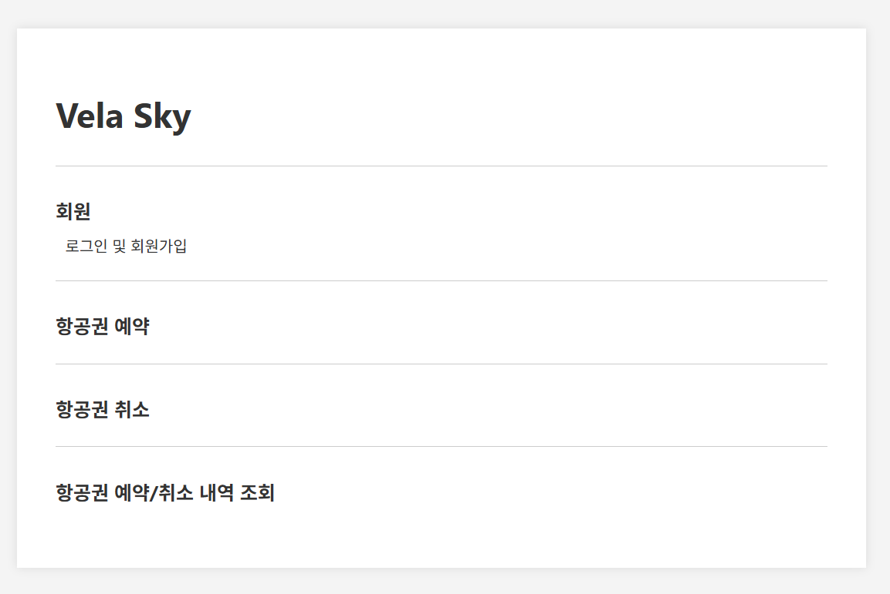
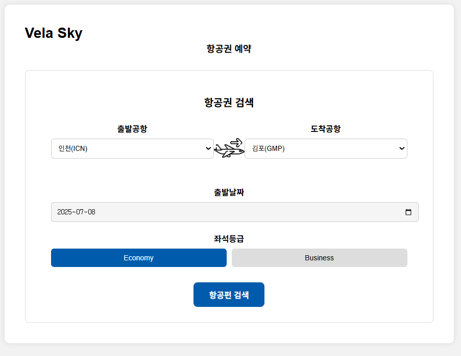
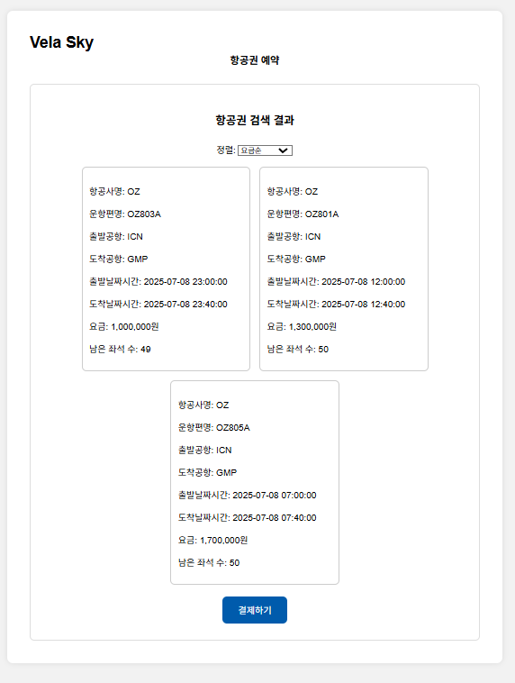
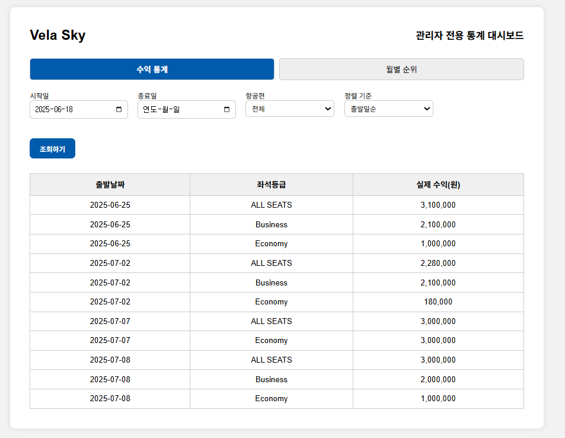
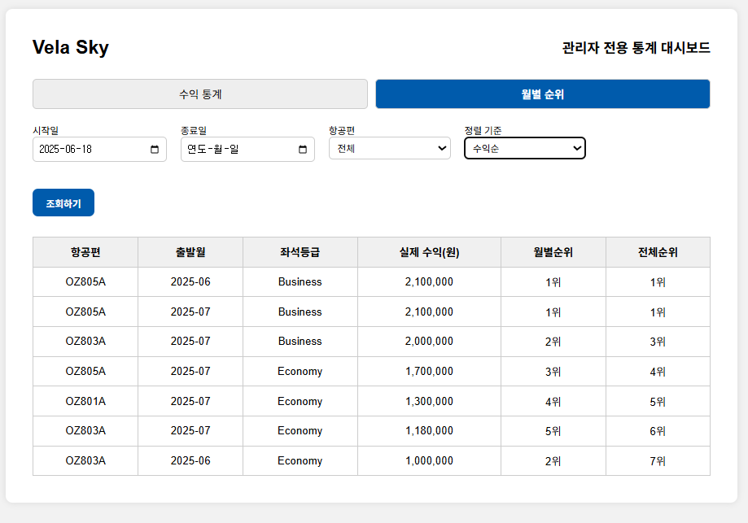

# VelaSky ✈️

PHP와 Oracle Database를 기반으로 구현한 **항공권 검색·예약·취소 웹 애플리케이션**입니다.

충남대학교 데이터베이스 과목 Term Project로 개발했으며,
사용자 인증부터 항공편 검색, 예약·취소, 예약 내역 조회,
이메일 알림 및 관리자 통계까지 데이터베이스 기반 웹 서비스의 전체 흐름을 구현했습니다.

---

## 주요 기능

### 사용자

- Session 기반 로그인 및 사용자 상태 관리
- 출발지 / 도착지 / 날짜 / 좌석 등급 기반 항공편 검색
- 가격순 / 출발시간순 검색 결과 정렬
- 좌석 등급별 잔여 좌석 실시간 계산
- 동일 항공편 중복 예약 방지
- 출발 완료 항공편 예약 차단
- 항공권 예약 및 취소
- 기간별 예약 / 취소 내역 조회
- 예약 완료 시 탑승권 정보 이메일 전송

### 관리자

- 항공편별 수익 통계 조회
- 좌석 등급별 / 전체 수익 집계
- 월별 항공편 수익 Ranking
- 기간 및 항공편 조건별 통계 필터링
- Ajax 기반 비동기 통계 조회

---

## Tech Stack

### Backend
- PHP
- PDO
- PHP Session

### Database
- Oracle Database 18c XE
- Oracle SQL

### Frontend
- HTML
- CSS
- JavaScript
- Ajax

### Library / Tools
- PHPMailer
- PHP dotenv
- Composer
- Apache
- Visual Studio Code

---

## Screenshots

### Main



### Flight Search



### Flight Search Results



### Admin Revenue Dashboard



### Admin Ranking Dashboard



---

## 주요 구현 내용

### 1. 항공편 검색 및 잔여 좌석 계산

사용자가 선택한 출발지, 도착지, 날짜, 좌석 등급을 기준으로
`SEATS`, `AIRPLAIN`, `RESERVE` 테이블을 조인하여 항공편을 조회합니다.

전체 좌석 수에서 해당 항공편의 예약 수를 차감하여
현재 예약 가능한 좌석 수를 계산하도록 구현했습니다.

검색 결과는 **가격순 또는 출발시간순**으로 정렬할 수 있습니다.

---

### 2. 예약 데이터 무결성 처리

예약 요청 시 다음 조건을 순차적으로 검증합니다.

1. 이미 출발한 항공편인지 확인
2. 해당 좌석 등급의 잔여 좌석 확인
3. 동일 사용자의 동일 항공편 중복 예약 여부 확인
4. 모든 조건을 통과한 경우 예약 정보 저장

예약 처리에는 Database Transaction을 적용하여
처리 중 오류 발생 시 `ROLLBACK`, 정상 완료 시 `COMMIT`하도록 구현했습니다.

---

### 3. 항공권 취소 및 환불금 계산

예약된 항공편 중 아직 출발하지 않은 항공편을 조회하고,
사용자가 선택한 예약을 취소할 수 있도록 구현했습니다.

출발일까지 남은 기간을 기준으로 위약금을 계산하고,

```text
환불금 = 결제금액 - 위약금
```

방식으로 환불 예정 금액을 산출합니다.

취소된 예약은 `CANCEL` 테이블에 기록하여
예약 / 취소 내역을 구분해 조회할 수 있도록 구성했습니다.

---

### 4. 예약 완료 이메일 전송

예약 완료 후 PHPMailer와 SMTP를 이용하여
사용자의 이메일로 탑승권 정보를 전송합니다.

메일에는 다음 정보가 포함됩니다.

- 항공사
- 운항편명
- 출발지 / 도착지
- 출발 / 도착 일시
- 좌석 등급

SMTP 인증정보는 `.env` 파일을 통해 관리합니다.

---

### 5. 관리자 통계 Dashboard

Oracle SQL의 `GROUPING SETS`와 `RANK()`를 활용하여
관리자용 통계 기능을 구현했습니다.

#### 수익 통계

```text
순수익 = 예약 결제금액 - 취소 환불금액
```

- 출발 날짜별 수익
- 좌석 등급별 수익
- 전체 좌석 수익

을 한 번에 조회할 수 있도록 구성했습니다.

#### Ranking

항공편 및 좌석 등급별 수익을 계산하고
`RANK()` Window Function을 활용하여
월별 수익 순위와 전체 수익 순위를 제공합니다.

---

## Database

프로젝트에서는 다음 주요 테이블을 사용합니다.

| Table | Description |
| --- | --- |
| `CUSTOMER` | 사용자 정보 |
| `AIRPLAIN` | 항공편 정보 |
| `SEATS` | 항공편별 좌석 및 가격 정보 |
| `RESERVE` | 예약 정보 |
| `CANCEL` | 예약 취소 및 환불 정보 |

---

## Security & Data Integrity

- PDO Prepared Statement를 통한 SQL Injection 방지
- `htmlspecialchars()`를 통한 출력 데이터 Escaping
- Session 기반 사용자 인증
- Transaction을 통한 예약 / 취소 데이터 일관성 관리
- `.env`를 통한 SMTP 인증정보 분리
- 사용자 입력값 및 요청 Parameter 검증

---

## Project Structure

```text
velasky-airline-reservation/
├── css/
│   └── ...                     # 페이지별 스타일
├── html/
│   ├── login.html
│   └── signup.html
├── img/
│   └── ...                     # 서비스 이미지
├── php/
│   ├── admin.php               # 관리자 통계 Dashboard
│   ├── cancel.php              # 예약 취소 화면
│   ├── confirm_cancel.php      # 예약 취소 처리
│   ├── confirm_payment.php     # 예약 및 이메일 전송
│   ├── flight_search.php       # 항공편 검색
│   ├── flight_search_result.php
│   ├── history.php             # 예약 / 취소 내역
│   ├── login.php
│   ├── logout.php
│   ├── main.php
│   ├── mypage.php
│   └── composer.json
├── docs/
│   └── screenshots/
├── .env.example
├── .gitignore
└── README.md
```

---

## Installation

### 1. Clone Repository

```bash
git clone https://github.com/soyun11/velasky-airline-reservation.git
cd velasky-airline-reservation
```

### 2. Install PHP Dependencies

PHP 의존성은 `php/composer.json`을 기준으로 설치합니다.

```bash
cd php
composer install
```

사용 라이브러리:

- `phpmailer/phpmailer`
- `vlucas/phpdotenv`

### 3. Environment Variables

프로젝트 루트의 `.env.example`을 복사해 `.env` 파일을 생성합니다.

```bash
cp .env.example .env
```

SMTP 정보를 자신의 환경에 맞게 설정합니다.

```env
SMTP_USER=your_email@example.com
SMTP_PASS=your_password
SMTP_HOST=smtp.example.com
SMTP_PORT=465
SMTP_SECURE=true
```

> `.env`에는 인증정보가 포함되므로 Git Repository에 커밋하지 않습니다.

### 4. Oracle Database

Oracle Database 환경을 구성한 후 다음 테이블이 필요합니다.

```text
CUSTOMER
AIRPLAIN
SEATS
RESERVE
CANCEL
```

본 프로젝트 최초 개발 환경에서는 Oracle Database 18c XE를 사용했습니다.

### 5. Run

프로젝트 루트에서 PHP Development Server를 실행할 수 있습니다.

```bash
cd ..
php -S 127.0.0.1:8000
```

브라우저에서 다음 주소로 접속합니다.

```text
http://127.0.0.1:8000/php/main.php
```

> 항공편 검색·예약·통계 등 Database 기능을 사용하려면
> Oracle Database와 PDO OCI 환경이 구성되어 있어야 합니다.

---

## Original Development Environment

본 프로젝트는 최초 개발 당시 다음 환경에서 구현 및 테스트했습니다.

- Windows 11
- PHP 8.1.3
- Apache 2.4.52
- Oracle Database 18c XE
- Oracle Instant Client 21.3
- Visual Studio Code

현재 PHP 기본 화면은 macOS 환경에서도 실행을 확인했습니다.

---

## Author

**박소윤**

- GitHub: https://github.com/soyun11